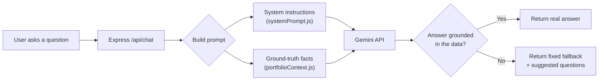
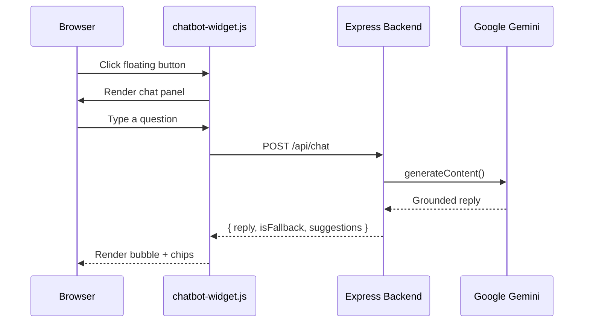

<div align="center">

# 🤖 Vinayak's Portfolio Assistant

**A grounded AI chatbot that answers questions about Vinayak Sharma — and *only* what's actually true.**

[](https://nodejs.org)
[](https://expressjs.com)
[](https://aistudio.google.com/apikey)
[]()
[](LICENSE)

*No hallucinated job titles. No made-up CGPA. If it's not on the site, the bot says so.*

</div>

---

## 📋 Table of Contents

- [What is this](#-what-is-this)
- [Live preview](#️-live-preview)
- [How it's grounded](#-how-its-grounded)
- [Architecture](#️-architecture)
- [Project structure](#-project-structure)
- [Quick start](#-quick-start)
- [API reference](#-api-reference)
- [Theming](#-theming)
- [Troubleshooting](#-troubleshooting)
- [Security notes](#️-security-notes)
- [Contact](#-contact)

---

## 💡 What is this

A floating chat widget for [vinayaksharma's portfolio site](#) that lets recruiters and visitors ask natural-language questions — *"What projects has he built?"*, *"Where did he intern?"*, *"What's his CGPA?"* — and get accurate, sourced answers instead of scrolling the whole page.

It's built from two independent pieces that talk to each other over HTTP:

| Piece | What it is | Where it runs |
|---|---|---|
| 🖼️ **Widget** | `chatbot-widget.js` + `.css` — a self-mounting vanilla JS chat UI, zero dependencies | In the browser, alongside `index.html` |
| ⚙️ **Backend** | Express API that grounds every answer in real portfolio data and calls Google Gemini | Node.js server (local or hosted) |

---

## 🖼️ Live Preview

<div align="center">

> 📸 *Drop a screenshot or GIF of the widget in action here — e.g. `docs/demo.gif` — and it'll render right in this spot on GitHub.*
>
> ```md
> 
> ```

</div>

---

## 🧠 How it's grounded

<details>
<summary><strong>Click to see the anti-hallucination pipeline</strong></summary>

<br>



- **`portfolioContext.js`** is the single source of truth — every fact the bot can ever state.
- **`systemPrompt.js`** instructs the model to *only* use that data and never invent details.
- If a question falls outside the data, the backend detects the fallback phrasing and serves **on-topic follow-up chips** instead of a dead end.

</details>

---

## 🏗️ Architecture



---

## 📁 Project Structure

```text
Portfolio/                         ← your site (git repo root)
├── index.html
├── style.css
├── script.js
├── chatbot-widget.js               ★ widget logic
├── chatbot-widget.css              ★ widget styling
│
└── portfolio-chatbot-backend/      ★ independent Node service
    ├── server.js                   Express app, /api/chat + /api/health
    ├── package.json
    ├── .env                        🔒 never committed (see .gitignore)
    ├── .gitignore
    ├── data/
    │   ├── portfolioContext.js     Ground-truth facts
    │   ├── systemPrompt.js         Assistant persona + rules
    │   └── suggestedQuestions.js   Quick-reply chip logic
    └── utils/
        └── retry.js                Exponential backoff for 429/5xx
```

---

## 🚀 Quick Start

```bash
# 1 — Backend
cd portfolio-chatbot-backend
npm install
cp .env.example .env          # then paste in your free Gemini key
npm start                     # → http://localhost:3001

# 2 — Frontend
# chatbot-widget.js/.css already live in Portfolio/ — just open index.html
```

<details>
<summary><strong>Getting a free Gemini API key (no credit card, ever)</strong></summary>

<br>

1. Go to **[aistudio.google.com/apikey](https://aistudio.google.com/apikey)**
2. Sign in with any Google account
3. Click **Create API key**
4. Paste it into `.env` as `GEMINI_API_KEY`

Google's free tier currently covers `gemini-3.6-flash` at generous daily limits — plenty for a portfolio site's traffic.

</details>

---

## 🔌 API Reference

### `GET /api/health`

```json
{ "status": "ok" }
```

### `POST /api/chat`

<table>
<tr><td><strong>Request</strong></td><td><strong>Response</strong></td></tr>
<tr valign="top">
<td>

```json
{
  "message": "What projects have you built?",
  "history": [
    { "role": "user", "content": "Hi" },
    { "role": "assistant", "content": "..." }
  ]
}
```

</td>
<td>

```json
{
  "reply": "Vinayak has built three projects: ...",
  "isFallback": false,
  "suggestions": [
    "What are your technical skills?",
    "Where did you study?"
  ]
}
```

</td>
</tr>
</table>

`history` is optional (last 6 turns used for follow-up context). `isFallback: true` means the question fell outside the portfolio data.

---

## 🎨 Theming

All colors are CSS variables — swap them and everything (button, header, bubbles, chips) re-themes instantly:

```css
.pc-chatbot-root {
  --chat-accent: #4338ca;
  --chat-accent-dark: #362f9e;
  --chat-bot-bg: #f1f0fb;
  --chat-bot-text: #1f1b3d;
  --chat-fallback-border: #d97706;
  --chat-error-border: #dc2626;
}
```

---

## 🛠️ Troubleshooting

<details>
<summary><code>Cannot find module '@google/genai'</code></summary>
<br>

`package.json` doesn't match what's installed. Run:
```bash
rm -rf node_modules package-lock.json
npm install
```
</details>

<details>
<summary><code>401 Incorrect API key provided</code></summary>
<br>

Your `.env` still has a placeholder or an old/revoked key. Get a fresh one from Google AI Studio, paste it into `.env`, then **restart the server** — `.env` is only read on startup.
</details>

<details>
<summary><code>404 model is no longer available to new users</code></summary>
<br>

Google renames/retires model IDs faster than most docs keep up. Update `MODEL_NAME` in `.env` to whatever the current Flash model is (check <a href="https://ai.google.dev/gemini-api/docs/models">ai.google.dev/gemini-api/docs/models</a>).
</details>

<details>
<summary><code>502 Bad Gateway</code> / replies cut off mid-sentence</summary>
<br>

Usually means the model's internal "thinking" tokens ate the whole output budget. Check `server.js` has both `thinkingConfig: { thinkingLevel: "minimal" }` and a `maxOutputTokens` of at least 400–500.
</details>

<details>
<summary>Widget loads but every message says "something went wrong"</summary>
<br>

Almost always CORS. Open DevTools → Console for the real error, then match `ALLOWED_ORIGIN` in `.env` **exactly** to your dev server's address (e.g. `http://127.0.0.1:5500`), and restart the backend.
</details>

---

## 🛡️ Security Notes

- ✅ API key lives only in `.env`, server-side — never shipped to the browser
- ✅ `.gitignore` excludes `.env` and `node_modules`
- ✅ Per-IP rate limiting (20 msgs/min) + exponential backoff on transient errors
- ✅ Input capped at 500 chars / 10kb body to limit abuse
- ⚠️ `portfolio-chatbot-backend` needs separate hosting (Render/Railway/Fly.io) — GitHub Pages can't run a Node server

---

## 📬 Contact

<div align="center">

[](mailto:Vinayaksharma2289@gmail.com)
[](https://linkedin.com/in/Vinayak2922k)
[](https://github.com/Vinayak2922k)

**Vinayak Sharma** · Alwar, Rajasthan, India

</div>

---

<div align="center">
<sub>Built with Express, vanilla JS, and Google Gemini — no frameworks, no lock-in, no cost.</sub>
</div>
